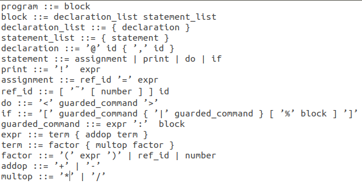

# E to Java Translator

## Authors
1. Davy Chuon
2. Varun Peesapati

## Objective of Project
The main objective of this project is to enable translation of E, an **Object
Oriented Language (OOPS)** that is similar to C++ into code that can be compiled
by the **Java Virtual Machine (JVM)**. In other words, this project translates
code written in E to code written in Java based on the grammar specified by the
BNF included below.

## BNF Used
  
**Note**: The BNF above only partially describes the E language with the non-
terminals in lowercase and terminals enclosed in single quotes ('').

## Implementation of Project

### Part 1: Lexical Analysis
In this part of the project, we read every character from our input (which is
the code written in E) and classify them into different tokens. In the long run,
this classification makes it easier to parse this input in parts 2 and 3. The
code for this is present in `Scan.java`, `Token.java`, and `TK.java`.

### Part 2: Syntactic Analysis
This part of the project was written in `Parser.java`, where after tokenizing
all the characters read from the input, we needed to parse it to check if the E
program is syntactically correct. We managed to accomplish this by implementing
a parse tree for all the different possibilities of code that could be present.

### Part 3: Semantic Analysis

### Part 4: Code Generation

## Usage
``` sh
$ make
$ java e2j
```
**Optional**: Can also redirect input from an E file as follows:
``` sh
$ make
$ java e2j < test.e
```

## Organization of Project
``` sh
$ tree .
.
├── e2j.java
├── EBNF.png
├── Makefile
├── Parser.java
├── README.md
├── Scan.java
├── SymbolTableItem.java
├── TK.java
└── Token.java
```